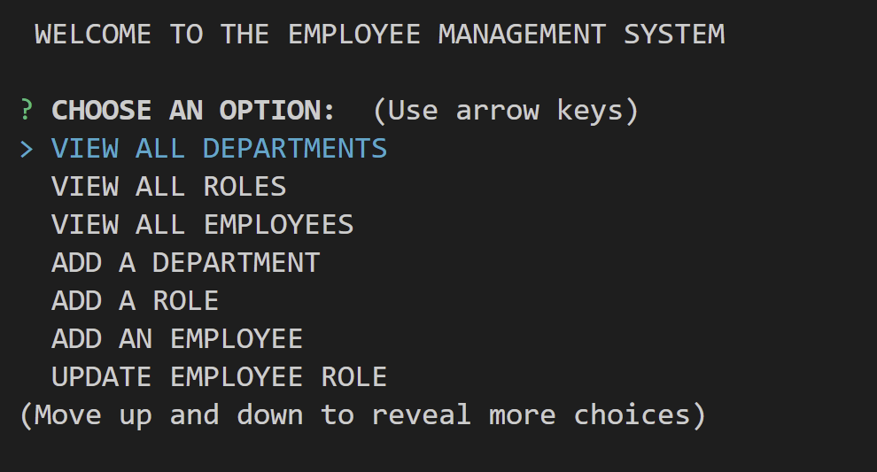

# Employee Management System
  
  
  
---

   
  
  ## Description 
  ---
  This is a command-line application that can be used to keep a track of a corporations departments, roles and employees. It has several functions that can be used to make changes and additions to the corporation's data.

  This is what the layout of the application looks like:
  
   

---

  

---

   

  ## Table of Contents
  - [Installation](#installation)
  - [Usage](#usage)
  - [Contributors](#contributors)
  - [Technologies](#technologies)
  - [License](#license)
  - [Questions](#questions)

   

  ## Installation 
  ---
  The installation of this application requires you to have ` mySQL ` installed on your machine. From the root directiory you will need to run the command ` source database/schema.sql ` followed by the command ` source database/seed.sql `. This will create the database for you and will add some seed data as well.

  Next, you will run the command ` node index ` and the program will start!

   

  ## Usage
  ---
  The application is very intuitve to use and can be understood just by reading the instructions provided when it is running.
  
  This video demonstrates various functions of the application:

  

 

  You can find this video inside the `assets` folder of this repository as well.

   

  ## Contributors
  ---
  Mohammad Abuzar Razvi

 

  ## Technologies
  ---

The technologies used in this app include:
* [Node.js](https://nodejs.org/en/)
* [MySQL](https://www.mysql.com/)

  ## License 
  ---
  Click the link below to learn more about the license for this project:

  <a href = "https://opensource.org/licenses/MIT"> MIT </a>
  
   

  ## Questions
  ---
  You can find other interesting projects that I have worked on at:
  <a href = "https://github.com/moecancode"> Github </a>

  If you have any questions about my projects, you can contact me directly at a.releven@hotmail.com. 
